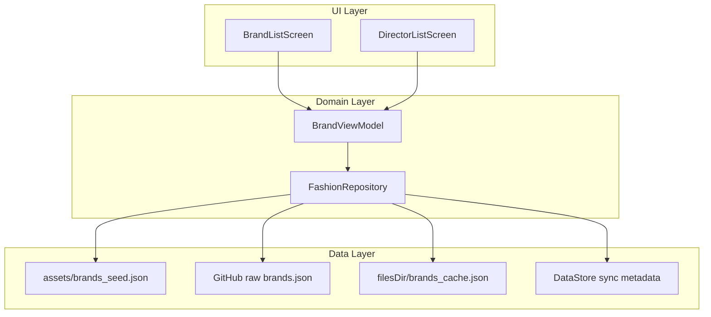

# Fashion Creative Directors — Android App Implementation Plan

## Goal

A simple, modern Android app for browsing curated fashion houses and their creative leadership history: current and past creative directors, roles, tenure dates, and short bios where available.

After you approve this plan, implementation will:
1. Create a **new GitHub repo** under the **Zahnma** account (not Manuel Noho)
2. Scaffold the Android project
3. Open a **draft PR** for your review

---

## API Research Summary

There is **no reliable free public API** today that returns structured creative-director tenure data for luxury fashion brands.

| Source | Fit | Verdict |
|--------|-----|---------|
| [TheFashionDB](https://thefashiondb.com/) | Best domain coverage (brands, appointments, bios) | **No public API** — editorial database only |
| [Fashionbi Encyclopedia](https://www.fashionbi.com/) | 300+ designers mapped to brands | **Not an API** — PDF/internal resource |
| [Wikidata SPARQL](https://query.wikidata.org/) (`P1037` director/manager) | Free, queryable | **Incomplete/inconsistent** for fashion — mixes CEOs and creative roles; tenure dates often missing |
| [Brandsearch API](https://docs.brandsearch.co/) | E-commerce brand metrics | **Wrong domain** — no creative directors |
| [IBM AI for Fashion](https://cognitivefashion.github.io/slate/) | Product catalog / visual search | **Wrong domain** |
| [Apshan](https://apshan.com/) | Fashion knowledge graph | **Enterprise / invite-only** |

**Recommended v1 strategy:** curated JSON bundled in the app + **remote JSON updates** from the same repo (GitHub raw URL). This matches your requirement: works offline immediately, updatable on the fly without an app store release for data-only changes.

**Future option:** if TheFashionDB or Wikidata coverage improves, add an optional enrichment layer behind a feature flag — but v1 should not depend on it.

---

## Proposed App Identity

| Item | Proposal |
|------|----------|
| App name | **Atelier** (working title — easy to change) |
| Repo name | `atelier-android` |
| Package | `com.zahnma.atelier` |
| GitHub owner | **Zahnma** |

---

## Tech Stack

Aligned with your existing Android work in [`Personal/health-data-dash/android`](Personal/health-data-dash/android):

- **Kotlin** + **Jetpack Compose** + **Material 3**
- **Navigation Compose** (2 screens + detail)
- **ViewModel** + **Repository** pattern
- **kotlinx.serialization** for JSON
- **OkHttp** + coroutines for remote fetch
- **DataStore** for last-sync metadata (version, etag, timestamp)
- **minSdk 26**, **targetSdk 35**, **Java 17**

No backend server required for v1.

---

## Architecture



### Data flow

1. **First launch:** load `assets/brands_seed.json` → display immediately (offline-first).
2. **Background sync:** fetch remote `data/brands.json` from repo (GitHub raw URL).
3. **If remote version > local version:** replace cache and refresh UI.
4. **Pull-to-refresh:** force sync attempt.
5. **Offline / fetch failure:** keep showing last good data (seed or cache).

Remote URL shape (example):

`https://raw.githubusercontent.com/Zahnma/atelier-android/main/data/brands.json`

---

## Data Model

Single versioned JSON file shared by app seed + remote updates.

```json
{
  "schemaVersion": 1,
  "dataVersion": "2026-07-05",
  "brands": [
    {
      "id": "chanel",
      "name": "Chanel",
      "country": "France",
      "founded": 1910,
      "category": "Haute couture",
      "logoUrl": null,
      "directors": [
        {
          "personId": "virginie-viard",
          "name": "Virginie Viard",
          "role": "Artistic Director",
          "startDate": "2019-02-19",
          "endDate": "2024-06-05",
          "isCurrent": false,
          "bio": "Succeeded Karl Lagerfeld as head of creative for Chanel."
        },
        {
          "personId": "matthieu-blin",
          "name": "Matthieu Blazy",
          "role": "Artistic Director",
          "startDate": "2025-12-09",
          "endDate": null,
          "isCurrent": true,
          "bio": "Former Bottega Veneta creative director."
        }
      ]
    }
  ]
}
```

Notes:
- `endDate: null` = current tenure
- `isCurrent` derived at parse time for sorting/filtering
- Dates in ISO-8601 for sorting and locale-aware display
- `dataVersion` enables cheap update checks before full parse

---

## Initial Brand List (~25 curated houses)

Seed data will cover major luxury/contemporary brands, e.g.:

Chanel, Dior, Louis Vuitton, Gucci, Prada, Hermès, Balenciaga, Saint Laurent, Bottega Veneta, Burberry, Versace, Valentino, Givenchy, Fendi, Loewe, Celine, Miu Miu, Tom Ford, Alexander McQueen, Jacquemus, Alaïa, Moschino, Armani, Dolce & Gabbana, Moncler

Each brand entry will include **all known current and past creative directors** we can reliably source at launch, with tenure dates and role titles.

**Data curation workflow (repo-side):**
- `data/brands.json` — canonical remote-updatable file
- `app/src/main/assets/brands_seed.json` — copy of same file at build time (or generated by Gradle copy task)
- `scripts/validate_brands_json.py` — CI check for schema, duplicate IDs, date ordering
- Optional `DATA.md` — sources and last-reviewed date per brand (maintainer doc, not in-app)

---

## UI / UX Design

**Design principles:** minimal, editorial, fast to scan — fashion-magazine clarity without visual clutter.

### Screen 1 — Brand list
- Top app bar: **Atelier**
- Search field (filter by brand name)
- Vertical list of brand cards:
  - Brand name (primary)
  - Country + category (secondary, muted)
  - Subtle chevron
- Pull-to-refresh indicator during sync
- Empty/error states with short copy

### Screen 2 — Creative directors (brand detail)
- Top app bar with back + brand name
- Optional brand header: founded year, country, one-line description
- Timeline-style list sorted **newest tenure first**
  - Director name
  - Role title (e.g. "Creative Director", "Artistic Director")
  - Tenure: `Feb 2019 – Jun 2024` or `Dec 2025 – Present`
  - Current directors visually distinguished (small badge or accent dot)
  - Expandable bio paragraph (collapsed by default to keep list clean)

### Visual theme (Material 3)
- **Light mode default:** off-white background (`#FAFAF8`), near-black text
- **Accent:** deep burgundy or charcoal (single accent, used sparingly)
- **Typography:** system default sans (Roboto) — no custom font files in v1
- **Spacing:** generous padding, 16dp list rhythm, no heavy shadows
- **Dark mode:** supported via Material 3 dynamic color off, fixed dark palette

Reference for code style: match Compose/M3 patterns from [`MainActivity.kt`](Personal/health-data-dash/android/app/src/main/kotlin/dev/vitals/sync/MainActivity.kt) and [`SettingsScreen.kt`](Personal/health-data-dash/android/app/src/main/kotlin/dev/vitals/sync/ui/SettingsScreen.kt).

---

## Project Structure

```
atelier-android/
├── app/
│   └── src/main/
│       ├── assets/brands_seed.json
│       ├── kotlin/com/zahnma/atelier/
│       │   ├── MainActivity.kt
│       │   ├── AtelierApp.kt              # theme + nav host
│       │   ├── data/
│       │   │   ├── FashionRepository.kt
│       │   │   ├── LocalDataSource.kt
│       │   │   ├── RemoteDataSource.kt
│       │   │   └── model/Brand.kt
│       │   ├── ui/
│       │   │   ├── brands/BrandListScreen.kt
│       │   │   ├── directors/DirectorListScreen.kt
│       │   │   ├── components/BrandRow.kt, DirectorRow.kt
│       │   │   └── theme/Color.kt, Theme.kt, Type.kt
│       │   └── viewmodel/BrandViewModel.kt
│       └── AndroidManifest.xml
├── data/brands.json                       # canonical updatable dataset
├── scripts/validate_brands_json.py
├── .github/workflows/android-ci.yml       # assembleDebug + JSON validate
├── IMPLEMENTATION_PLAN.md                 # this document (committed)
├── README.md
├── build.gradle.kts
└── settings.gradle.kts
```

---

## Implementation Steps

### Phase 1 — Repo & scaffold (Day 1)
- Create `Zahnma/atelier-android` repo
- Initialize Gradle project (Compose, M3, Navigation, serialization, OkHttp, DataStore)
- Add `IMPLEMENTATION_PLAN.md` and README with build/run instructions
- Configure debug signing for local APK sideload (same pattern as health-data-dash)

### Phase 2 — Data layer (Day 1–2)
- Define Kotlin `@Serializable` models
- Implement `LocalDataSource` (assets + file cache)
- Implement `RemoteDataSource` (OkHttp fetch + version compare)
- Implement `FashionRepository` with offline-first merge logic
- Author initial `data/brands.json` for ~25 brands with full director histories

### Phase 3 — UI (Day 2)
- Material 3 theme
- Brand list screen with search + pull-to-refresh
- Director detail screen with timeline rows + expandable bios
- Navigation: `brands` → `brands/{brandId}/directors`

### Phase 4 — Polish & CI (Day 3)
- Loading / error / empty states
- Date formatting utility (`Present` for open tenures)
- GitHub Actions: `./gradlew assembleDebug` + JSON validation script
- Manual QA on emulator (API 34) and one physical device if available

### Phase 5 — Draft PR (Day 3)
- Branch: `feat/initial-app`
- Draft PR to `main` on **Zahnma** account
- PR description: screenshots, test plan, data update instructions

---

## GitHub / Account Setup

- All commits and PR authorship under **Zahnma**
- Use `gh` CLI with Zahnma credentials (or SSH key for that account)
- Draft PR title: **feat: initial Atelier Android app — brand & creative director browser**
- Repo visibility: **public** (recommended so raw JSON URL works without auth) — change to private if you prefer

---

## Testing Plan

- [ ] App launches offline with seed data
- [ ] Brand search filters correctly
- [ ] Tapping a brand opens director timeline
- [ ] Current vs past directors sort and display correctly
- [ ] Pull-to-refresh updates when remote `dataVersion` is newer
- [ ] Failed network keeps last cached data
- [ ] Dark mode readable
- [ ] CI passes on PR

---

## Out of Scope for v1 (future ideas)

- User accounts / favorites
- Push notifications for appointment changes
- Images/logos per brand (can add `logoUrl` later)
- Wikidata/TheFashionDB live enrichment
- Play Store release pipeline

---

## Risks & Mitigations

| Risk | Mitigation |
|------|------------|
| Creative director data goes stale quickly | Remote JSON + documented update workflow; show `dataVersion` in About screen |
| No stable third-party API | Own curated dataset; don't block v1 on external APIs |
| Tenure date ambiguity across sources | Store best-known dates; optional `notes` field for disputed ranges |
| Wrong GitHub account on commits | Verify `gh auth status` / git config before first push |

---

## What Happens After You Approve

1. Create `Zahnma/atelier-android` on GitHub
2. Implement Phases 1–5 above
3. Open draft PR for your review
4. You can iterate on app name, brand list, and design in follow-up PRs
